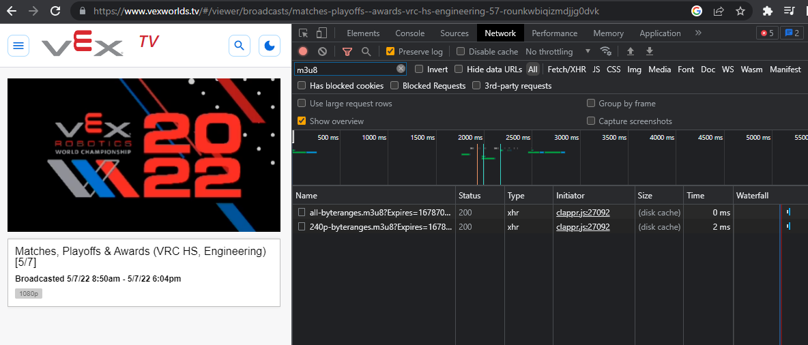
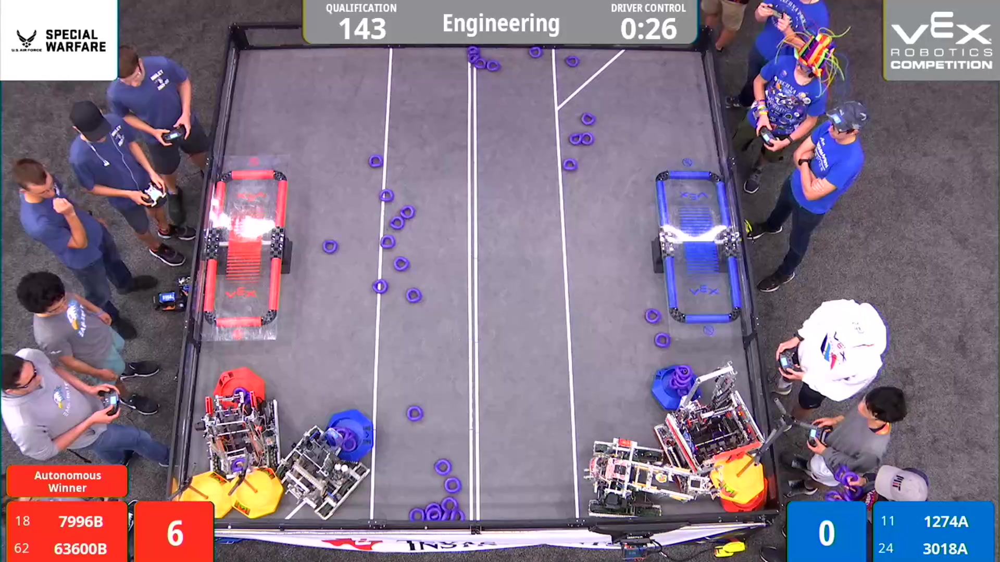
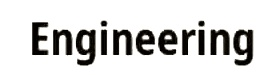
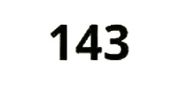

# Cut To The Bot Vods

This program aims to automate the parsing of Vex Robotics Competitions into individual matches by using text Object Character Recognition (OCR) to identify the starting and ending times of matches from the competition overlay. You can find the matches on the [Cut To The Bot Vods Youtube Channel](https://www.youtube.com/@CutToTheBotVod)

## Libraries Used: 
  - [OpenCV](https://github.com/opencv/opencv-python)
  - [tesserocr](https://github.com/sirfz/tesserocr)
 
 Additionally, [FFmpeg](https://ffmpeg.org/) must be installed on your computer. 
  
## Detailed Explaination

**Step 1:** Obtaining the match from VexTV

  Vex uses a service called [BoxCast](https://www.boxcast.com/) to host their live streaming website. All of their streams are played back as m3u8 streams, which can be thought of as a playlist of smaller videos. Getting the links to these streams could be automated with scraping, but since I do not have permission to scrape VexTV, I will show you how to manually get the link to them. 
  
  
  By using the Network tab in developer tools while opening the BoxCast stream, then searching for m3u8, you can find the allbyteranges.m3u8 file. After clicking that, you can get the response which is a BoxCast link to the stream. That is what you will need to copy into the program. 
  
**Step 2:** Grabbing individual frames at specific timestamps
  
  Using FFmpeg, we can set a specific timestamp to load the m3u8 stream at, then grab a single frame of it using:
  ```
  $ ffmpeg -ss {TIMESTAMP} -copyts -i {URL} -frames:v 1 -q:v 1 {OUTPUT FILE NAME}
  ```
  
  From the Worlds Livestreams, this would give an image something like this: 


**Step 3:** Getting match info from frame

  This is the part where we use openCV and text OCR! Because text OCR is very finnicky with the images it can preoperly read, this is where most of the time was spent to get this working. The steps I found to most accuratly read the division name and qual number out of these matches was by:
  
  - Inverting the colors of the image to turn the text from white to black
  - Maximizing the brightness on the image to get rid of any noise, leaving just the black text
  - Slicing out only the reagions that contain the qualification number and division name from the full frame 
  - Creating artificial boarders around the text because OCR has trouble reading characters that are close to the sides of images 
  - Using OCR to grab the Qualification number and Division name from those frames 
  - Using that information, Parse the division results json from RobotEvents and save that specific matches results. 

After the image processing, the qualification number and division name images look like this: 
   

## Conclusion

Using the steps mentioned above, this program is able to find the starts and ends of matches by recording when the qualification number changes on the match overlay. The program has a few other optimizations that are not worth covering here, but are documented in the code. 

Feel free to use this code or modify it however you need! 

## Special Thanks

- [Cut To the Bot Videos](https://www.youtube.com/@cuttothebotvideos3345) for initially going through older worlds matches manually and inspiring this project. 
  
    

